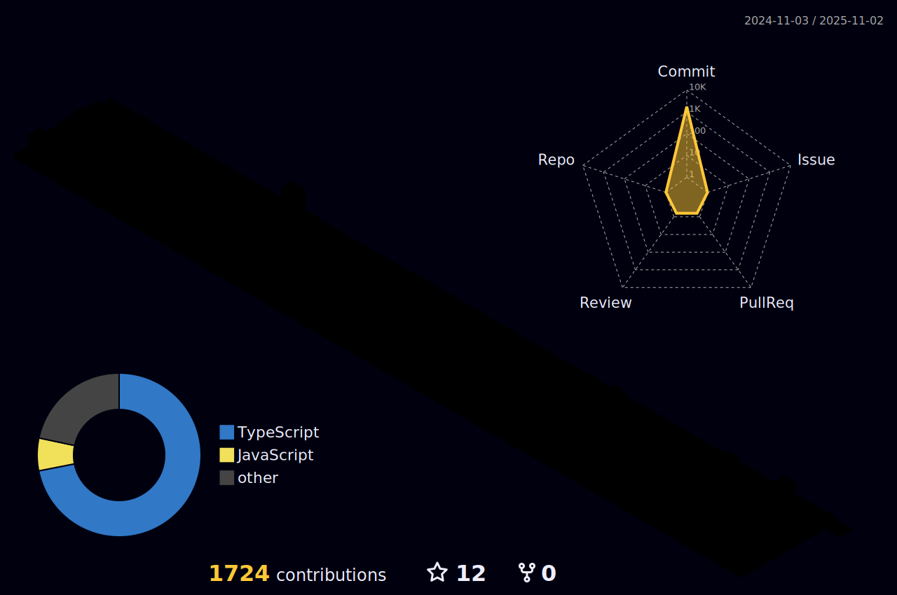

<!--  -->
<h2>Contact</h3>
  <h4 align="left">📧 [Gmail] (rec8730@gmail.com)</h4>
  
   
  
  <h3 align="left">📚 Front-end developers </h3>  

  <h4>Stack language</h4>
  
  

  <h4>Frameworks & lib</h4>
  
  
  

  <h4>Styles</h4>
  
  
  
  

  <h4>State</h4>
  
  

  <h4>Others</h4>
  
  

   
  

   
   
     
   
   
   
  

