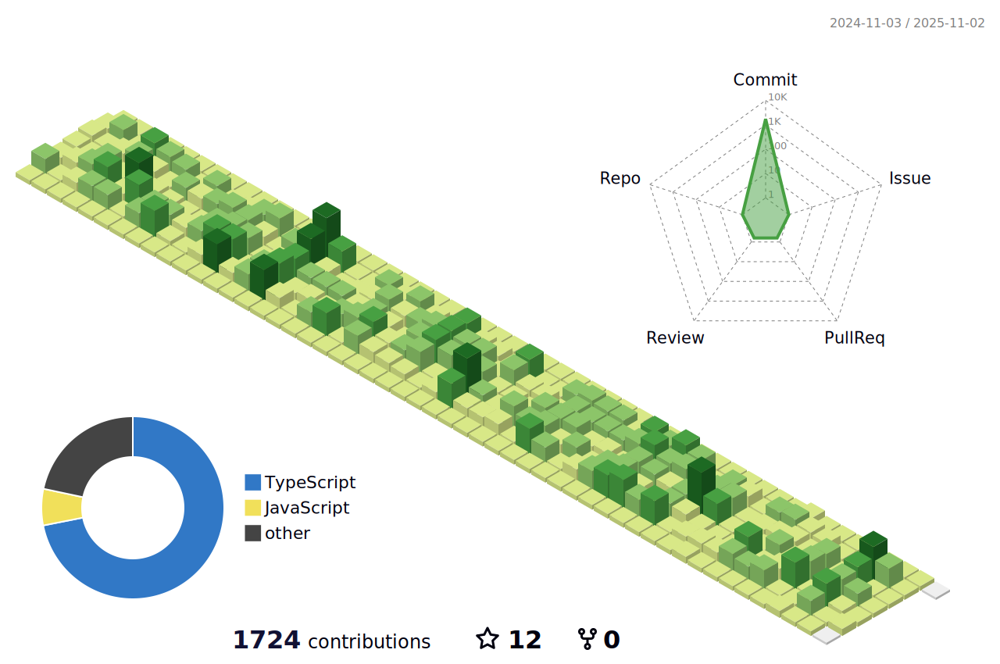

  

<!--  -->

<h4>📜 [Blog] (https://rec8730.tistory.com/)</h4>
<h4>  [Instagram] (https://www.instagram.com/0112mm_nin/)</h4>
<h4>📧 [Gmail] (rec8730@gamil.com)

  <h3>📚 My tech stack </h3>
 

  
  
  
  
  
  
  
  
  
 

 
 

   <h3>💡 Recent projects</h3>
   
   
[NuT] (https://jihoon8730.github.io/nutSide/)

   <h3>💡 Recent posts</h3>
   
2023년 4월 17일

   <a href="https://rec8730.tistory.com/149">
 react-hook-form 효율적으로 사용해보기 - 1 
</a>
 

 

  
     
   
   
   
  

